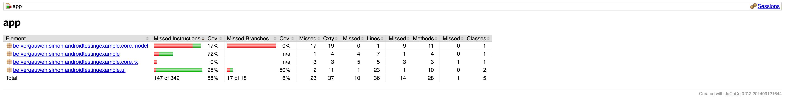
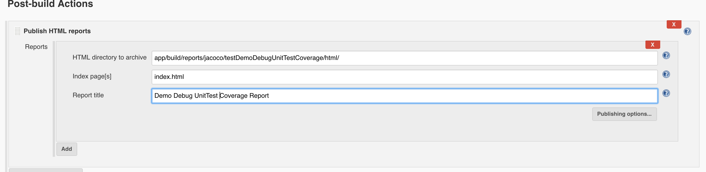
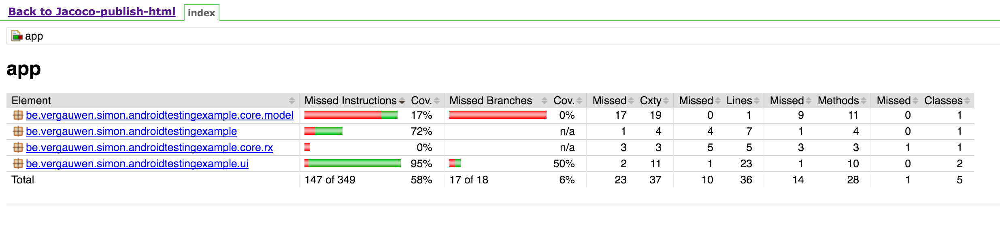

# Android Gradle Jacoco (Test coverage)

## Setting up Jacoco

* First of all we'll have to setup Jacoco in Gradle. In order to avoid creating an enourmous gradle file, we'll create a gradle file seperately for Jacoco. This can be than be copied to any project and be imported into any build.gradle you need it.

* By default there is a gradle folder in the root of your android project. This folder contains the Gradle wrapper, a little bit more about this in the Robolectric setup below. Within this folder we'll create a `jacoco.gradle` file. Don't worry if you don't have a lot of experience with gradle or groovy, it will all be explained below. If you don't require the extra explanation just checkout the code in this repo, `/gradle/jacoco.gradle`.

## jacoco.gradle

* `apply plugin: 'jacoco'`, if we apply the plugin here it automatically gets applied to the `build.gradle` we import this script into. You don't have to worry about dependencies, the android gradle plugin takes care of this for us!

* I like to specify what jacoco is used because there can be some weird side-effects with jacoco versions. The version shown here should work fine! But more about this in the Jenkins/Robolectric setup.
```
jacoco {
    toolVersion = "0.7.2.201409121644"
}
```

* Now for the real gradle work!
* We want the `jacoco` tasks to run after after the project is `evaluated`.

>  Such a listener gets notified when the build file belonging to this project has been executed.

```
project.afterEvaluate {
	// Where we'll do all our work!
}
```
* First we're going to `collect` all the `buildTypes` and `productFlavors` into a `List<T>`. In case there were no product flavors defined, we'll add an empty string element to the list.
```
def buildTypes = android.buildTypes.collect { type -> type.name }
def productFlavors = android.productFlavors.collect { flavor -> flavor.name }
if (!productFlavors) productFlavors.add('')
```
**In our example we used the default build types (debug & release), and we defined a product flavor free and paid**
* So we end up with 4 different build variants in AS:
	* freeDebug
	* paidDebug
	* freeRelease
	* paidRelease
* Because AS defines them productFlavorBuildType we'll be doing the same. So we'll have double `foreach` loop that loops through our `productFlavors` and `buildTypes`. And since our source paths follow the same pattern we can define these at once as well. so we get `freeDebug` and `free/debug`on our first iteration, we need to do some more stuff in this iteration beside just defining it's name and path so let's do that!
```
productFlavors.each { productFlavorName ->
        buildTypes.each { buildTypeName ->

            def sourceName, sourcePath
            if (!productFlavorName) {
                sourceName = sourcePath = "${buildTypeName}"
            } else {
                sourceName = "${productFlavorName}${buildTypeName.capitalize()}"
                sourcePath = "${productFlavorName}/${buildTypeName}"
            }
        }
    }
```
* For each `build variant` we want to create a gradle task that generates the jacoco coverage report. So let's define a name for the gradle task first. The result being a task named `testFreeDebugUnitTestCoverage` in our first iteration. This is also the name you need to excecute to generate a test coverage report for this build variant `gradle testFreeDebugUnitTestCoverage`, to check what gradle tasks are available for your project execute `gradle tasks --all`.
```
def testTaskName = "test${sourceName.capitalize()}UnitTestCoverage"
 
 //noinspection GroovyAssignabilityCheck
 task "${testTaskName}"(type: JacocoReport, dependsOn: "$testTaskName") {
     //task code
 }
```
**Use `//noinspection GroovyAssignabilityCheck` to get rid of the annoying lint warning, it's a common issue.**

* So let's do some playing nice stuff first. Setting the `group` and `description` of the task
```
group = "Reporting"
description =
        "Generate Jacoco coverage reports on the ${sourceName.capitalize()} build."
```
* Now finally for the Jacoco specific settings!! First let's set the `class directories` (Source sets that coverage should be reported for.) For our `freeDebug build variant` this would be `app/build/intermediates/classes/free/debug/be/vergauwen/simon/androidgradlejacoco`. To get a correct coverage report we need to **exclude** a bunch of class files. For example the files generated by libraries (dagger,butterknife,...). The files android generates (R, Manifest, BuildConfig, ...). When using a library you trust the developer that it works correctly, so these should not be included in our test coverage reports. 
```
//Directory where the compiled class files are
classDirectories =
        fileTree(dir: "${project.buildDir}/intermediates/classes/${sourcePath}",
            excludes: ['**/R.class',
                       '**/R$*.class',
                       '**/*$ViewInjector*.*',
                        **/*$ViewBinder*.*',
                        '**/BuildConfig.*',
                        '**/Manifest*.*',
                        '**/*$Lambda$*.*', // Jacoco can not handle several "$" in class name.
                        '**/*Module.*', // Modules for Dagger.
                        '**/*Dagger*.*', // Dagger auto-generated code.
                        '**/*MembersInjector*.*', // Dagger auto-generated code.
                        '**/*_Provide*Factory*.*',
                        '**/*_Factory.*', //Dagger auto-generated code
                        '**/*$*$*.*' // Anonymous classes generated by kotlin
                        ])
```
**In case you're still seeing a classes that should not be included in your coverage report, exclude them here**

* Next we define the source directories
```
sourceDirectories = files(["src/main/java",
                           "src/$productFlavorName/java",
                           "src/$buildTypeName/java"])
```
* And as our last jacoco paramater we need to define where our jacoco generated `.exec` files are located.
```
executionData = files("${project.buildDir}/jacoco/${testTaskName}.exec")
```

**It is important to see the difference here! Our gradle tasks will generate our coverage reports! And our `apply plugin: 'jacoco'` will generate the `.exec` files while building the project**

* Finally we define in which format we want our coverage report to be in
```
reports {
    xml.enabled = true
    html.enabled = true
}
```

#### Getting the coverage report
* In order to get the coverage report we still have to add the `jacoco.gradle` script to our `app/build.gradle`. We can add gradle scripts as follows `apply from: rootProject.file('gradle/jacoco.gradle')` (/gradle/jacoco.gradle)

* Now that we added the script when we run the tasks command `gradle tasks --all` you should find the **Reporting** `Group` we defined with the Coverage report tasks.
```
Reporting tasks
---------------
testfreeDebugUnitTestCoverage - Generate Jacoco coverage reports on the freeDebug build.
testpaidDebugUnitTestCoverage - Generate Jacoco coverage reports on the paidDebug build.
testfreeReleaseUnitTestCoverage - Generate Jacoco coverage reports on the freeRelease build.
testpaidReleaseUnitTestCoverage - Generate Jacoco coverage reports on the paidRelease build.
```

1. We need to create the `.exec` files, which get created during building (since the jacoco plugin is applied to the `build.gradle` script. **DUH** --> `gradle build` or `./gradlew build` if your using the gradle wrapper.
2. When the `.exec` files are created (/app/build/jacoco), you can run the gradle tasks to create the reports
3. `gradle testDemoDebugUnitTestCoverage` (gradle supports multiple commands at once so you can run all at once, just seperate the tasks with a whitespace.
4. The report can now be found in `/app/build/reports/jacoco/testDemoDebugUnitTestCoverage/` and the html version should looks something like this.



## Robolectric & Jenkins
* There are a lot of know issues with Robolectric and Jacoco.
* The above used jacoco version will give the correct test coverage when using robolectric for unit testing. **AWESOME** I'm done! Well if you're using Jenkins and using the jacoco plugin you'll see a totally different result, the Robolectric tests are not included! (ノಠ益ಠ)ノ彡┻━┻
* Why!? The jacoco plugin creates the coverage reports for you instead of gradle, and is using the latest version. In other words, our older jacoco version we defined in our gradle script has 0 influence on our jacoco plugin and thus the "fix" is not working for Jenkins.
* Luckily I found two solutions!

**Powermock seems to have the same issues as Robolectric, but both solution explained here should solve that 2. But I have not confirmed it yet.**

#### Publish HTML result

* In case you want to keep to above explained script, and thus not use a later version of Jacoco and gradle (currently) 2.13-rc1. You can just publish the HTML reports created by our gradle script.
* First of all it's important to know that you have to run the `gradle tasks` in order to create the reports, opposed to just building the project and having `jenkins jacoco plugin` generate the reports.
* So for our example the `invoke gradle script` would look something like this:
```
clean
build
testfreeDebugUnitTestCoverage
testpaidDebugUnitTestCoverage
testfreeReleaseUnitTestCoverage
testpaidReleaseUnitTestCoverage
```

* To publish the html report we'll be using `HTML Publisher plugin`. **Beware, you have to specify a new report for every build variant report.**
* All you have to do in order to publish the html report is specify the location of the report, and give it a name.



* Now a report will be added, beware only the latest report will be viewable on the project page! And does not provide a graph like the `jacoco plugin`.




#### Latest version all the things!!
* When using gradle 2.13 and a jacoco version >= 0.7.6, we have some extra options!!
* We can specify the following `testOptions` for our android build.
```
android {
    testOptions {
        unitTests.all {
            jacoco {
                includeNoLocationClasses = true
            }
        }
    }
}
```

**Beware you need gradle version 2.13 in order to be able to use this option, or update your gradle version to 2.13**
**When using the wrapper use `./gradlew`, if you've updated you can use `gradle`**
--> Change the `distributionUrl` in your gradle-wrapper.properties to `https\://services.gradle.org/distributions-snapshots/gradle-2.13-20160228000026+0000-all.zip`

* Since we fixed the Robolectric bug, Jenkins can now happily show the correct test coverage result with the jacoco plugin

**Setting up the Jacoco plugin is very similar to the gradle tasks we wrote. Except for that looping through build variants we need to hardcore the paths.**

* For our example the values would look like this:
	* Path to exec files: `app/build/jacoco/*.exec`
	* Path to class directories:
	```
	app/build/intermediates/classes/free/**/be/vergauwen/simon/androidgradlejacoco,
	app/build/intermediates/classes/paid/**/be/vergauwen/simon/androidgradlejacoco
	```
	* Path to source directories: `app/src/main/java, app/src/paid/java, app/src/free/java`
	* Exclusions: `**/R.class,**/R$*.class,**/*$ViewInjector*.*,**/*$ViewBinder*.*,**/BuildConfig.*,**/Manifest*.*,**/*$Lambda$*.*,**/*Module.*,**/*Dagger*.*,**/*MembersInjector*.*,**/*_Provide*Factory*.*,**/*_Factory*.*,**/*$*$*.*`
	
* And hopefully you'll have a result as the following:


#### Sources
* https://docs.gradle.org/current/userguide/build_lifecycle.html
* https://github.com/dampcake/Robolectric-JaCoCo-Sample
* https://habrahabr.ru/company/rambler-co/blog/266837/
* https://github.com/jacoco/jacoco/pull/288
* https://github.com/appfoundry/android-project-template/blob/master/gradle/jacoco.gradle
